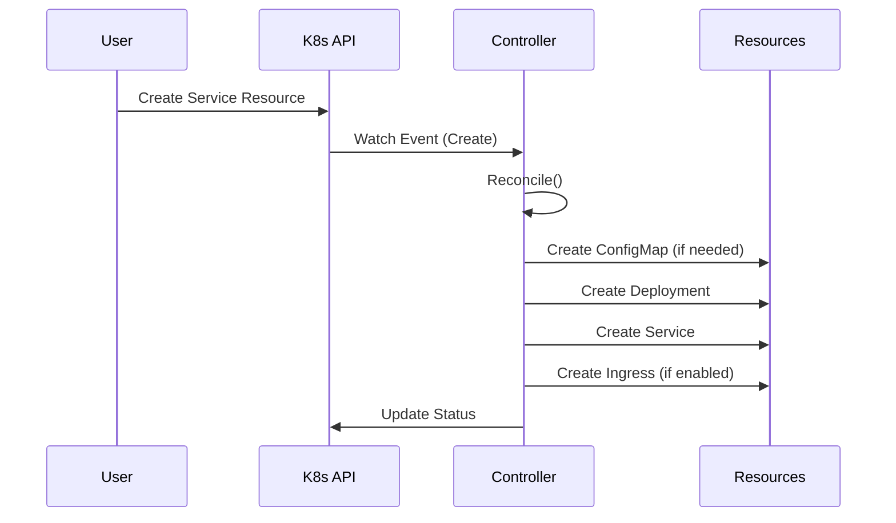
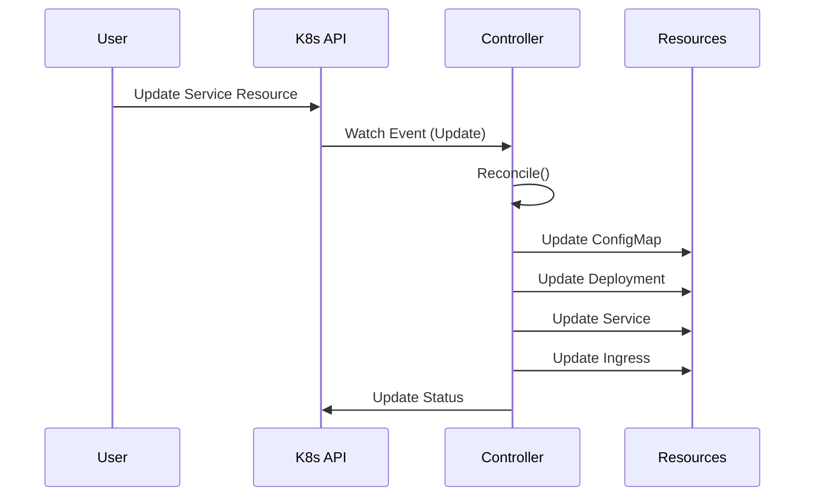
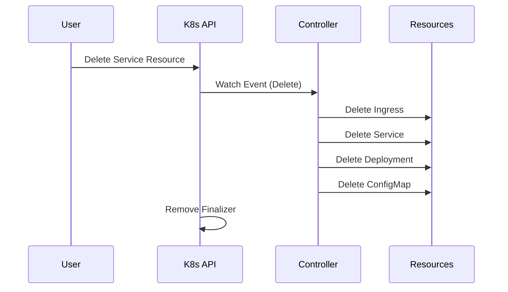

# 架构设计

本文档描述了 Service Operator 的整体架构设计和实现原理。

## 概述

Service Operator 是一个 Kubernetes Operator，用于简化和自动化完整服务的部署和管理。它通过单个自定义资源 (CRD) 来管理 Deployment、ConfigMap、Service 和 Ingress 等多个 Kubernetes 资源。

## 架构图

```
┌─────────────────────────────────────────────────────────────┐
│                    Kubernetes Cluster                       │
│                                                             │
│  ┌─────────────────┐    ┌─────────────────────────────────┐ │
│  │  Service CRD    │    │      Service Operator          │ │
│  │                 │    │                                 │ │
│  │  ┌───────────┐  │    │  ┌─────────────────────────────┐│ │
│  │  │ Service   │◄─┼────┼──┤   Service Controller        ││ │
│  │  │ Resource  │  │    │  │                             ││ │
│  │  └───────────┘  │    │  │  - Reconcile Loop           ││ │
│  └─────────────────┘    │  │  - Resource Management      ││ │
│                         │  │  - Status Updates           ││ │
│  ┌─────────────────┐    │  └─────────────────────────────┘│ │
│  │ Managed         │    │                                 │ │
│  │ Resources       │    │  ┌─────────────────────────────┐│ │
│  │                 │    │  │      Manager                ││ │
│  │ ┌─────────────┐ │    │  │                             ││ │
│  │ │ Deployment  │◄┼────┼──┤  - Leader Election          ││ │
│  │ └─────────────┘ │    │  │  - Metrics & Health         ││ │
│  │ ┌─────────────┐ │    │  │  - Webhook Server           ││ │
│  │ │ ConfigMap   │◄┼────┼──┤  - Cache Management         ││ │
│  │ └─────────────┘ │    │  └─────────────────────────────┘│ │
│  │ ┌─────────────┐ │    └─────────────────────────────────┘ │
│  │ │ Service     │◄┼──────────────────────────────────────┘ │
│  │ └─────────────┘ │                                        │
│  │ ┌─────────────┐ │                                        │
│  │ │ Ingress     │◄┼──────────────────────────────────────┐ │
│  │ └─────────────┘ │                                      │ │
│  └─────────────────┘                                      │ │
└───────────────────────────────────────────────────────────┘ │
                                                              │
┌─────────────────────────────────────────────────────────────┘
│                    External Access
│
│  ┌─────────────────┐    ┌─────────────────┐
│  │   Ingress       │    │   Load          │
│  │   Controller    │    │   Balancer      │
│  │                 │    │                 │
│  └─────────────────┘    └─────────────────┘
│
└─────────────────────────────────────────────
                    │
                    ▼
              ┌─────────────┐
              │   Users     │
              └─────────────┘
```

## 核心组件

### 1. Service CRD

自定义资源定义，定义了服务的期望状态：

```go
type ServiceSpec struct {
    Image       string                   `json:"image"`
    Replicas    *int32                  `json:"replicas,omitempty"`
    Port        int32                   `json:"port,omitempty"`
    ServiceType string                  `json:"serviceType,omitempty"`
    ConfigData  map[string]string       `json:"configData,omitempty"`
    Env         []EnvVar               `json:"env,omitempty"`
    Resources   *ResourceRequirements   `json:"resources,omitempty"`
    Ingress     *IngressSpec           `json:"ingress,omitempty"`
}
```

### 2. Service Controller

核心控制器，实现了 Kubernetes Controller 模式：

- **Reconcile Loop**: 持续监控资源状态并进行调谐
- **Resource Management**: 创建、更新、删除相关的 Kubernetes 资源
- **Status Updates**: 更新 Service 资源的状态信息
- **Error Handling**: 处理各种错误情况和重试逻辑

### 3. Manager

Controller Runtime 管理器，负责：

- **Leader Election**: 在多副本部署中选举主控制器
- **Metrics & Health**: 提供监控指标和健康检查端点
- **Cache Management**: 管理 Kubernetes 资源的本地缓存
- **Webhook Server**: 可选的准入控制 Webhook

## 工作流程

### 1. 资源创建流程



### 2. 资源更新流程



### 3. 资源删除流程



## 设计原则

### 1. 声明式 API

- 用户只需声明期望状态，Operator 负责实现
- 支持 Kubernetes 原生的 YAML 配置
- 遵循 Kubernetes API 约定

### 2. 控制器模式

- 使用 Controller Runtime 框架
- 实现标准的 Reconcile 循环
- 支持事件驱动的资源管理

### 3. 资源所有权

- 使用 OwnerReference 建立资源关系
- 支持级联删除
- 防止资源泄漏

### 4. 状态管理

- 维护资源的观察状态
- 提供详细的状态信息
- 支持条件 (Conditions) 机制

## 扩展性设计

### 1. 插件化架构

```go
type ResourceManager interface {
    Reconcile(ctx context.Context, service *Service) error
    Delete(ctx context.Context, service *Service) error
}

type ServiceController struct {
    managers []ResourceManager
}
```

### 2. Webhook 支持

- 准入控制 (Admission Control)
- 变更 (Mutating) Webhook
- 验证 (Validating) Webhook

### 3. 多版本支持

- API 版本化
- 向后兼容
- 平滑升级

## 安全考虑

### 1. RBAC 权限

最小权限原则，只授予必要的权限：

```yaml
rules:
- apiGroups: ["apps"]
  resources: ["deployments"]
  verbs: ["get", "list", "watch", "create", "update", "patch", "delete"]
- apiGroups: [""]
  resources: ["services", "configmaps"]
  verbs: ["get", "list", "watch", "create", "update", "patch", "delete"]
- apiGroups: ["networking.k8s.io"]
  resources: ["ingresses"]
  verbs: ["get", "list", "watch", "create", "update", "patch", "delete"]
```

### 2. 网络安全

- 使用 TLS 加密通信
- 限制网络访问
- 支持网络策略

### 3. 容器安全

- 非 root 用户运行
- 只读根文件系统
- 禁用特权提升

## 监控和可观测性

### 1. 指标 (Metrics)

- Controller Runtime 内置指标
- 自定义业务指标
- Prometheus 格式导出

### 2. 日志 (Logging)

- 结构化日志
- 多级别日志
- 上下文信息

### 3. 追踪 (Tracing)

- 分布式追踪支持
- 请求链路追踪
- 性能分析

### 4. 健康检查

- Liveness Probe
- Readiness Probe
- 自定义健康检查

## 性能优化

### 1. 缓存优化

- 本地缓存减少 API 调用
- 智能缓存失效
- 批量操作支持

### 2. 并发控制

- 工作队列 (Work Queue)
- 并发限制
- 背压处理

### 3. 资源管理

- 内存使用优化
- CPU 使用优化
- 垃圾回收调优

## 测试策略

### 1. 单元测试

- 控制器逻辑测试
- 工具函数测试
- 模拟 (Mock) 测试

### 2. 集成测试

- envtest 框架
- 真实 Kubernetes 环境
- 端到端测试

### 3. 性能测试

- 负载测试
- 压力测试
- 基准测试

## 部署架构

### 1. 单集群部署

```
┌─────────────────────────────────────┐
│           Kubernetes Cluster        │
│                                     │
│  ┌─────────────────────────────────┐│
│  │      service-operator-system    ││
│  │                                 ││
│  │  ┌─────────────────────────────┐││
│  │  │   Service Operator Pod      │││
│  │  │                             │││
│  │  │  - Controller Manager       │││
│  │  │  - Metrics Server           │││
│  │  │  - Health Check             │││
│  │  └─────────────────────────────┘││
│  └─────────────────────────────────┘│
│                                     │
│  ┌─────────────────────────────────┐│
│  │        Application Namespaces   ││
│  │                                 ││
│  │  Service Resources              ││
│  │  Managed Resources              ││
│  └─────────────────────────────────┘│
└─────────────────────────────────────┘
```

### 2. 多集群部署

```
┌─────────────────┐    ┌─────────────────┐
│   Cluster A     │    │   Cluster B     │
│                 │    │                 │
│  ┌─────────────┐│    │  ┌─────────────┐│
│  │ Operator    ││    │  │ Operator    ││
│  │ Instance A  ││    │  │ Instance B  ││
│  └─────────────┘│    │  └─────────────┘│
│                 │    │                 │
│  ┌─────────────┐│    │  ┌─────────────┐│
│  │ Services    ││    │  │ Services    ││
│  │ A1, A2, A3  ││    │  │ B1, B2, B3  ││
│  └─────────────┘│    │  └─────────────┘│
└─────────────────┘    └─────────────────┘
```

## 未来规划

### 1. 功能增强

- 支持更多 Kubernetes 资源类型
- 高级部署策略 (蓝绿部署、金丝雀发布)
- 自动扩缩容集成

### 2. 生态集成

- Helm Chart 支持
- ArgoCD/Flux 集成
- 服务网格支持

### 3. 多云支持

- 云原生存储集成
- 多云负载均衡
- 跨云灾难恢复

这个架构设计确保了 Service Operator 的可扩展性、可维护性和生产就绪性。